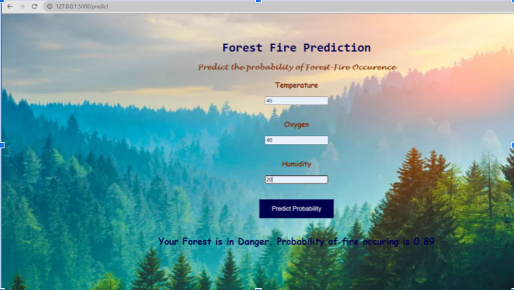

# Forest-Fire-Prediction

Forest or Wildlife fires are uncontrolled fires in area of combustible vegetation. These forest fires can be man-made or caused by mother nature by different weather conditions, torrential winds. These fires cause damages not only to the environment they also destroy vast homes and property.

## Home Screen

## Explaination
Basically, I modeled some parameters crucial for any forest fire to take place and predict the possibility of a forest fire taking place based on that. 
In my dataset, I have examples of forest fires that took place and collect the data prior to the fire taking place, which is publicly available. I have the inputs as oxygen, humidity, temperature and the output as 0 or 1 based on whether or not a fire took place.
The project can successfully predict the probability of a fire taking place in an area given the 3 parameters.

